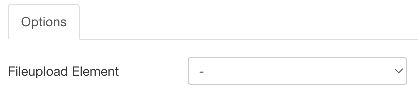
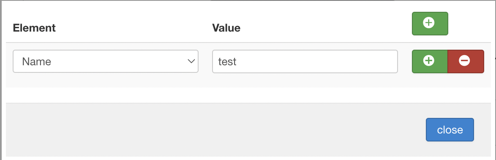
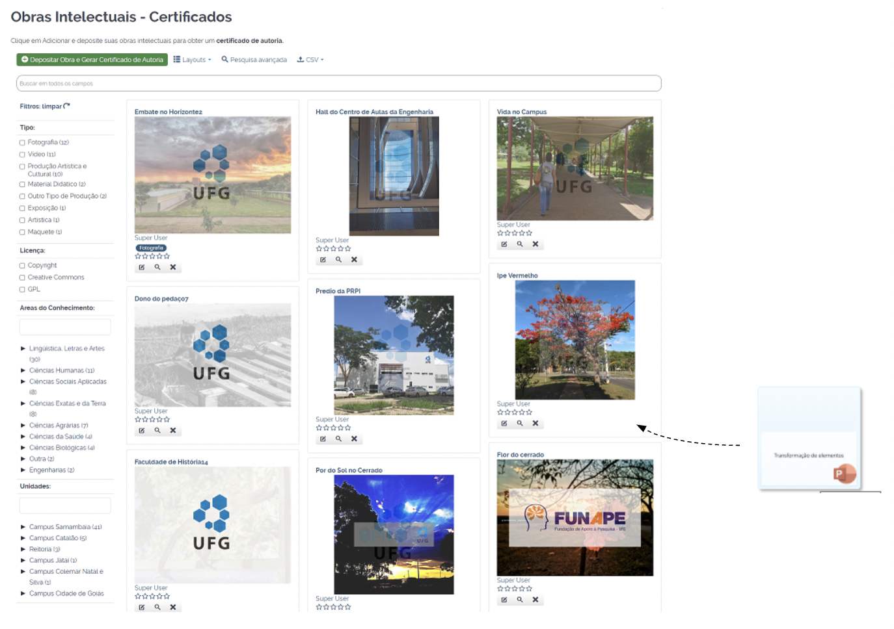
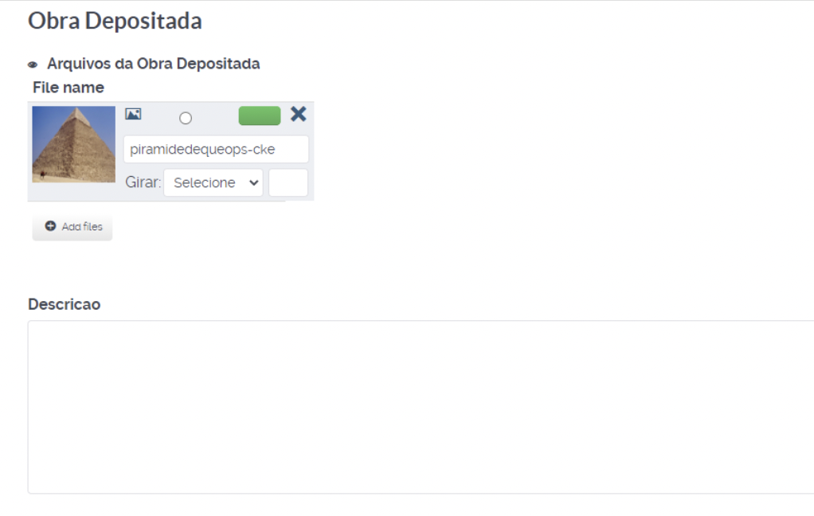

# Drag and Drop File Plugin

Drag and Drop File is a plugin created to meet the need to add usability to the user, making it easier to start filling out a registration form. This way, the user can drag and drop a file into a Fabrik list and an Add form will automatically open with the file already present in the fileupload element.

## Content

- [Configuration](#configuration)
- [Usage](#usage)

### Configuration

With the plugin properly installed in Joomla, there are some settings to be made for correct operation.

 
In Fileupload Element, select the Fabrik element of type fileupload to which the file dragged to the list will be attached.

 
Under Required elements, select the elements that must be initialized for the record to be displayed.  
 

### Usage

When dragging a file to the list, Fabrik's Add interface will open with the dragged file already attached to an element of the fileupload type:

   
  Moment where the file is dragged to the list

 

   
  Moment where the "Add" interface is opened with the file attached.

